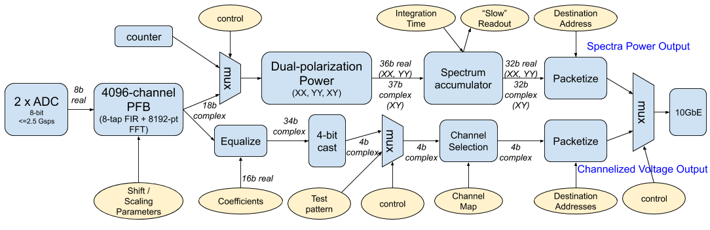

# Firmware Overview

The provided firmware implements a 4096-channel polyphase filter banks on each of two independent analog inputs. The pipeline is compiled for a Xilinx XC7k160t-based [SNAP board][https://casper.ssl.berkeley.edu/wiki/SNAP].

The signal processing pipeline takes as input two data streams sampled at up to 2500 Msps with 8 bits resolution. These are provided by the CASPER-designed [ADC5g card][https://casper.ssl.berkeley.edu/wiki/ADC1x5000-8], which interfaces with a SNAP board via a ZDOK connector.

The pipeline -- shown in high-level form below, with processing modules shown in blue and runtime settings shown in yellow circles -- creates two output data products: accumulated spectral power, and channelized voltages. One of these two outputs can be selected for output over a 10GbE link.

## Channelization
Both processing pipelines share a common polyphase-filterbank channelizer, formed from an FIR filter and subsequent FFT. This channelizer takes real-valued 8-bit voltages as its inputs, and outputs 18 bit complex (i.e. 18-bit real + 18-bit imaginary) spectra with 4096 channels critically sampling the system's Nyquist band. When operated at the maximum ADC sample rate of 2500 Msps, each spectrum comprises 4096 channels each approximately 305 kHz wide.

In the channelization pipeline, all coefficients are stored as 18 bit complex values, normalized to a range of +/-1, and an 18 bit data path is maintained throughout the filter.
A runtime-configurable "shift schedule" is used to optionally enact divide-by-two operations on the data path after each FFT butterfly stage to prevent data overflows. The pipeline shift schedule is user-chosen based on the observed antenna power levels at the start of an observation.

## Spectrometer Pipeline
The Spectrometer pipeline computes the accumulated power of the upstream spectra. It is designed to be used with applications which don't require access to voltages such as pulsar detection, overall system health monitoring, etc.

First, the auto- and cross-power of the pairs of inputs are computed at full precision. 18-bit voltage inputs are converted into 36-bit unsigned powers (in the autocorrelation case) or 37-bit signed complex cross-powers.

In the accumulation stage of the spectrometer, these powers are scaled down by a factor of 4096 using a round-to-even scheme, and then successive spectra are summed into a 32-bit signed vector accumulator.\
Accumulation length is a runtime-controlled parameter, and data may be streamed out over 10GbE (appropriate for short <<1s accumulation period) or polled via a remote software process.

### Output Data Format

The spectrometer pipeline outputs data as a UDP packet stream. Each packet comprises a payload of 32-bit signed integers, with a 64-bit header.

uint64 header
int32 data[channel, stokes]

*header*

The header should be read as a network-endian 64-bit unsigned integer, with the following bit fields:
 - bits[7:0] : bit antenna ID
 - bits[10:8] : 3-bit channel block index
 - bits[55:11] : time index
 - bits[63:56] : 8-bit packet version. Most significant bit is always 0 for spectrometer packets

*data*

The data payload in each packet is 8192 bytes.

The complete payload is an array of 32-bit integers with dimensions `channel x polarization-product`, with
 - channel index running from 0 - 512
 - polarization-product running from 0-3 with:
   - index 0: XX product
   - index 1: YY product
   - index 2: real(XY*) product
   - index 3: imag(XY*) product

## Voltage Pipeline
The voltage pipeline is designed to facilitate downstream processing such as rechannelization, interferometry, coherent dedispersion, modulation classification, etc, which require undetected voltage inputs.

The voltage pipeline performs no averaging, and thus operates at lower bit precision than the spectrometer pipeline in order to fit into a limited (10Gb/s) output bandwidth. In the provided firmware, the voltage pipeline outputs 4 bit complex samples.

Prior to quantization to 4 bits, tuning of signal levels is possible by multiplying each 4096 point, 18 bit, complex FFT spectra with a vector of 16 bit coefficients. Each coefficient has a range of 0-2048, and a resolution of 0.03125. The FPGA design stores independent coefficients for each analog input and each polyphase-filterbank channel.

Following this equalization step, each sample is quantized to 4 bit complex representation, using a round-to-even scheme. Values are saturated at a value of +/- 7, in order to maintain symmetry around zero.

If operated at the maximum supported ADC sample rate of 1250 Msps, the total system bandwidth after 4-bit quantization is 20 Gb/s. In order to maintain a rate less than 10 Gb/s, only a subset of frequency channels are transmitted.

### Output Data Format

The voltage pipeline outputs data as a UDP packet stream. Each packet comprises a payload of 4+4 bit complex samples, with a 64-bit header.

uint64 header
uint8 data[time, channel, polarization]

*header*

The header should be read as a network-endian 64-bit unsigned integer, with the following bit fields:
- bits [5:0] : 6 bit antenna number
- bits [17:6] : 12 bit channel number (indicating the index of the first channel in the packet)
- bits[55:18] : 56 bit sample number (since each packet contains 16 samples, this header entry counts in units of 16 spectra. I.e., if it is 0, the packet contains samples from spectra 0 through 15, if it is 1, the packet contains samples from spectra 1 6 through 31)
- bits[63:56] : 8-bit version number. Most significant bit is 1 for voltage capture packets

*data*

The data payload in each packet is 8192 bytes. Each byte of data should be interpretted as 4+4 bit complex values, with the most significant 4 bits representing the real part of the complex sample, and the least significant 4 bits representing the imaginary part of the complex sample.

The complete payload is an array with dimensions `time x channel x polarization`, with
 - time index running from 0 - 15
 - chan index running from 0 - 255
 - polarization index running from 0 - 1
