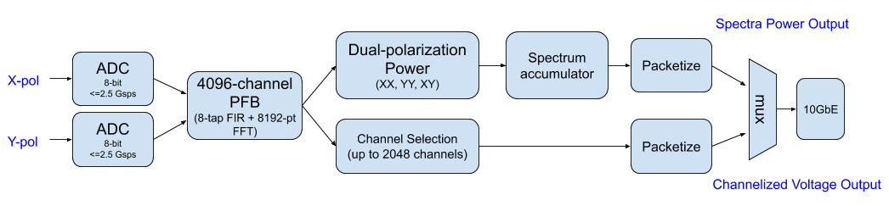
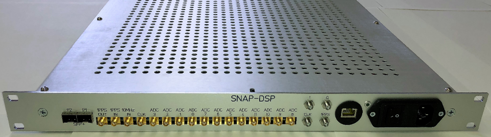
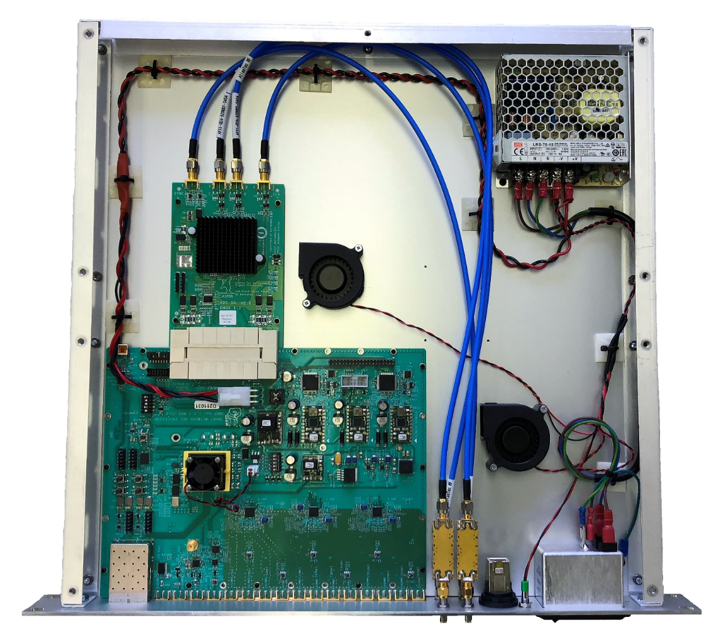
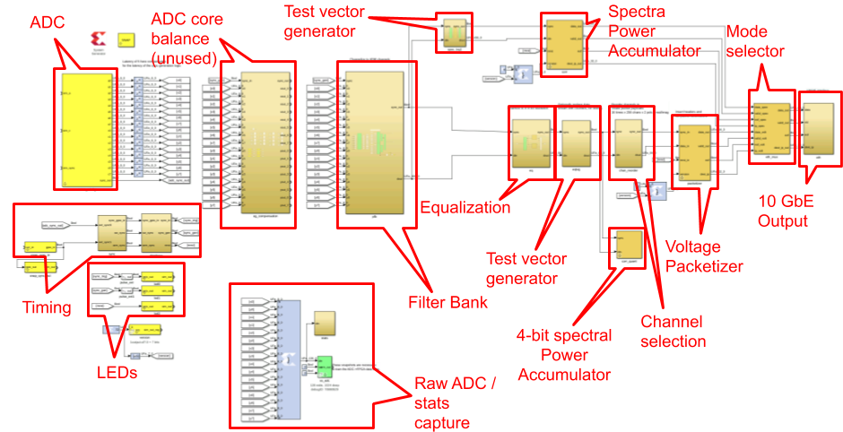
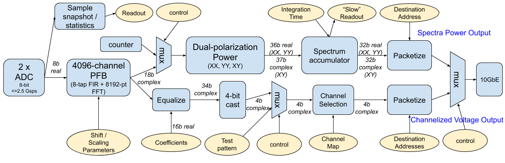
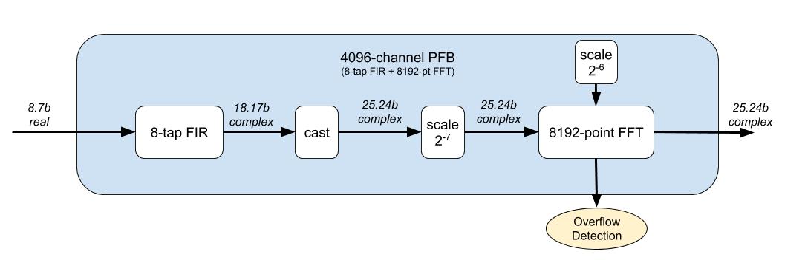

.. |version| replace:: 2.0.0

ATA SNAP F-Engine Firmware User Manual
======================================
..
  As part of the Allen Telescope Array (ATA) refurbishment project, the digitization and channelization hardware used at the ATA has been upgraded to use the Xilinx Kintex 7 ``SNAP'' platform. Each SNAP board provides more processing power than the iBoB platform it replaces, and potentially allows wider bandwidth processing. This document describes the functionality of the SNAP F-Engine hardware and firmware, including its user interface and run-time parameters.


Introduction
------------
This repository contains firmware and software for a SNAP-based F-Engine (i.e. channelizer) system for the Allen Telescope Array (ATA).

The system digitizes RF signals from the ATA at a speed, :math:`f_s`, of up to 2500 Msps and generates 4096 frequency channels over the Nyquist band.
Two operational modes are supported: *Spectrometer* mode, and *Voltage* mode. These different modes, shown in a high-level block diagram in :numref:`fig-ata-snap-feng-overview`, apply different processing to the channelizer output prior to outputing data over 10 gigabit Ethernet (10GbE).


    
    The ATA SNAP F-Engine firmware comprises two pipelines. One of these -- the *Spectrometer* pipeline -- generates accumulated power spectra. The other -- the *Voltage Pipeline* -- generates a complex voltage stream channelized into 2048 frequency bins.


Spectrometer Mode
~~~~~~~~~~~~~~~~~

In *Spectrometer* mode, integrated power spectra are generated by the SNAP Firmware.
The resolution of these spectra, :math:`f_c`, is :math:`\frac{f_s}{8192}`.
At maximum sampling rate, :math:`f_s = 2500` Msps, resulting in a spectra resolution :math:`f_c = 305` kHz.

Spectra are generated for both the X- and Y-polarizations, which are formatted as an :math:`f_c`-element array of 32-bit signed integers.
A cross-power spectra, defined as the multiple of an X-polarization spectra with the complex conjugate of a Y-polarization spectra, is also computed.
This is formatted as an :math:`f_c`-element array of 32-bit complex (i.e. 32-bit real, 32-bit imaginary) signed integers.

Data are accumulated for a runtime-configurable number of spectra, and are output from the firmware as a UDP data stream over a 10 Gb Ethernet link.
The output format is described in detail in :ref:`sec-data-format`.

Voltage Mode
~~~~~~~~~~~~

In *Voltage* mode, up to 2048 frequency channels - each with a resolution of :math:`\frac{f_s}{8192}` - are output over a 10 Gb Ethernet link.

In this mode, data are transmitted as complex, signed, 4-bit integers over a UDP data stream.

This Document
~~~~~~~~~~~~~

This document describes the hardware configuration required by the F-Engine system, the runtime configuration proceedures, and the software control functionality made available to the user.
It also provides a description of the output data formats of each of the two data processing modes.

Nomenclature
------------

Data Types
~~~~~~~~~~

Throughout this document, data types are labelled in diagrams using the nomenclature :math:`X.Y\mathrm{b}`. Unless otherwise stated, this indicates an :math:`X`-bit signed, fixed-point number, with :math:`Y` bits below the binary point.

Where this document indicates an :math:`N`-bit complex number, this implies a :math:`2N`-bit value  with an :math:`N`-bit real part in its most-significant bits, and an :math:`N`-bit imaginary part in its least-significant bits.

.. _sec-data-format:

Output Data Formats
-------------------

.. _sec-spec-format:

Spectrometer Packets
~~~~~~~~~~~~~~~~~~~~

In versions >1.1.x  of the SNAP firmware, each spectrometer dump is a 64 kiB data set, comprising 4096 channels and 4 32-bit floating point (IEEE 754 single precision: 1-bit sign, 8-bit exponent, 23-bit fraction)  words per channel.
Each data dump is transmitted from the SNAP in 8 UDP packets, each with an 512 channel (8 kiB) payload and 8 byte header:

.. code-block:: C

  #define N_c 512
  #define N_p 4

  struct spectrometer_packet {
    uint64_t header;
    float data[N_c, N_p] // IEEE 754 single precision float
  };

The header should be read as a network-endian 64-bit unsigned integer, with the following bit fields:
  - bits[7:0] (i.e. ``header & 0xff``) : 8-bit antenna ID
  - bits[10:8] (i.e. ``(header >> 8) & 0x7``) : 3-bit channel block index
  - bits[55:11] (i.e. ``(header >> 11) & 0x1fffffffffff``) : 45-bit accumulation ID
  - bits[63:56] (i.e. ``(header >> 56) & 0xff``) : 8-bit firmware version

Headers fields should be interpretted as follows:
  - *Antenna ID*: A runtime configurable ID which uniquely associates a packet with a particular SNAP board and antenna.
  - *Channel block index*: Indicates which channels are in this packet. A value of :math:`b` indicates that this packet contains channels :math:`512b` to :math:`512(b+1)`.
  - *Accumulation ID*: A counter that represents the integration number. I.e., the first integration will have an ID 0, the second and ID 1, etc. These IDs should be referred to GPS time through knowledge of the system sampling rate and accumulation length parameters, and the system was last synchronized (see `sec-timing`).
  - *Firmware version*: Bit [7] is always 0 for *Spectrometer* packets. The remaining bits contain a compile-time defined firmware version, represented in the form bit[6].bits[5:3].bits[2:0]. This document refers to firmware version |version|.

The data payload in each packet should be interpretted as an 8192 byte array of 32 bit floats with dimensions ``channel x polarization-product``.
The ``channel`` index runs from 0 to 511.
The ``polarization-product`` index runs from 0-3 with:

  - index 0: :math:`XX` product
  - index 1: :math:`YY` product
  - index 2: *real* part of :math:`XY^*` product 
  - index 3: *imag* part of :math:`XY^*` product 

Voltage Packets
~~~~~~~~~~~~~~~

The *Voltage* mode of the SNAP firmware outputs a continuous stream of voltage data, encapsulated in UDP packets.
Each packet contains a data payload of 8192 bytes, made up of 16 time samples for up to 256 frequency channels of dual-polarization data:

.. code-block:: C

  #define N_t 16
  #define N_p 2

  struct voltage_packet {
    uint8_t version;
    uint8_t type;
    uint16_t n_chans;
    uint16_t chan;
    uint16_t feng_id
    uint64_t timestamp;
    complex4 data[n_chans, N_t, N_p] // 4-bit real + 4-bit imaginary
  };

The header entries are all encoded network-endian and should be interpretted as follows:
  - ``version``; *Firmware version*: Bit [7] is always 1 for *Voltage* packets. The remaining bits contain a compile-time defined firmware version, represented in the form bit[6].bits[5:3].bits[2:0]. This document refers to firmware version |version|.
  - ``type``; *Packet type*: Bit [0] is 1 if the axes of data payload are in order [slowest to fastest] channel x time x polarization. This is currently the only supported mode. Bit [1] is 0 if the data payload comprises 4+4 bit complex integers. This is currently the only supported mode.
  - ``n_chans``; *Number of Channels*: Indicates the number of frequency channels present in the payload of this data packet.
  - ``chan``; *Channel number*: The index of the first channel present in this packet. For example, a channel number ``c`` implies the packet contains channels ``c`` to ``c + n_chans - 1``.
  - ``feng_id``; *Antenna ID*: A runtime configurable ID which uniquely associates a packet with a particular SNAP board.
  - ``timestamp``; *Sample number*: The index of the first time sample present in this packet. For example, a sample number :math:`s` implies the packet contains samples :math:`s` to :math:`s+15`. Sample number can be referred to GPS time through knowledge of the system sampling rate and accumulation length parameters, and the system was last synchronized. See `sec-timing`.

The data payload in each packet is determined by the number of frequency channels it contains.
The maximum is 8192 bytes.
If ``type & 2 == 0`` each byte of data should be interpretted as a 4-bit complex number (i.e. 4-bit real, 4-bit imaginary) with the most significant 4 bits of each byte representing the real part of the complex sample in signed 2's complement format, and the least significant 4 bits representing the imaginary part of the complex sample in 2's complement format.

If ``type & 1 == 1`` the complete payload is an array with dimensions ``channel x time x polarization``, with

  - ``channel`` index running from 0 to ``n_chans``
  - ``time`` index running from 0 to 15
  - ``polarization`` index running from 0 to 1 with index 0 representing the X-polarization, and index 1 the Y-polarization.


Hardware Overview
-----------------

A pair of analog inputs to the SNAP system are digitized with a CASPER-designed *ADC5g* ADC card [casper_adc5g]_ which hosts a single e2v EV8AQ160 chip [e2v]_.
The EV8AQ160 is a cost-effective 8-bit, quad-channel, 1250 Msps ADC, which can be configured to run as a dual-channel 2500 Msps, or single-channel 5000 Msps digitizer. The ATA system uses dual-channel configuration, with each ADC5g card processing dual polarization inputs from a single dish.

Digital signal processing is performed using a CASPER-designed SNAP board [casper_snap]_.
The SNAP is a simple FPGA-based processor, featuring a low-cost Kintex 7 FPGA, and a pair of SFP+ connectors each capable of supporting a 10~Gb Ethernet link.
In addition to the FPGA, the SNAP hosts three on-board Hittite HMCAD1511 ADC chips [hmcad1511]_, which are not used in the ATA deployment owing to their relatively low sampling rate.

SNAPs and their ADCs are housed in a custom-designed 1U enclosure, shown in :numref:`fig-snap-box-front` and :numref:`fig-snap-box-internal`.
This box also houses a Raspberry Pi 2 Model B [rpi]_ which provides the ability to remotely program and interact with a SNAP board.



    The custom-designed 1U SNAP enclosure front panel. Interfaces (left to right): A pair of 10GbE-capable SFP+ ports; SMA input for a trigger signal; SMA output for a trigger signal; SMA input for onboard-ADC reference clock (not used at the ATA); SMA inputs for onboard-ADC sample clock (not used at the ATA); SMA inputs for 12 on-board ADC channels (not used at the ATA); four SMA inputs routed to the ADC5G card -- dual RF inputs, a sampling clock, and a trigger signal; RJ45 1GbE interface routed to an internal Raspberry Pi single-board computer; 110-230V AC power.



    Internal wiring of the ATA SNAP enclosure. Not shown is a Raspberry Pi control computer, whose mount holes are visible to the upper-right of the SNAP board. RF anti-aliasing filters are visible on the ADC analog RF inputs. These may be removed if upstream filtering is present in the system.

The complete ATA system, comprising multiple boards, should be driven by a common sampling clock, at a maximum rate of 2500~Msps. Each board should also be fed with a time-aligned trigger signal, which is used to synchronize the the capture of data by different boards in the system.


Firmware Overview
-----------------

The firmware described in this document is designed in Mathwork's Simulink using CASPERs FPGA programming libraries.
The Simulink source file is available `on github <https://github.com/realtimeradio/ata_snap/blob/master/snap_adc5g_feng_rpi.slx>`_.

Building the Simulink Model
~~~~~~~~~~~~~~~~~~~~~~~~~~~

The SNAP firmware model (``snap_adc5g_feng_rpi.slx``)  was built with the following software stack.
Use other versions at your peril.

  - Ubuntu 18.04 64-bit
  - MATLAB/Simulink 2019a, including Fixed Point Designer Toolbox
  - Xilinx Vivado System Edition 2019.1.3
  - ``mlib_devel`` (version controlled within the ``ata_snap`` repository.

To obtain and open the Simulink model:

.. code-block:: console

  # Clone the firmware repository
  git clone https://github.com/realtimeradio/ata_snap

  # Clone relevant sub-repositories
  cd ata_snap
  git submodule init
  git submodule update

  # Install the mlib_devel dependencies
  # You may want to install these in a Python virtual environment
  cd mlib_devel
  pip install -r requirements.txt

Next, create a local environment specification file in the ``ata_snap`` directory, named ``startsg.local``.
An example environment file is:

.. code-block:: console

  #!/bin/bash
  ####### User to edit these accordingly ######
  export XILINX_PATH=/data/Xilinx/Vivado/2019.1
  export MATLAB_PATH=/data/MATLAB/R2019a
  # PLATFORM lin64 means 64-bit Linux
  export PLATFORM=lin64
  # Location of your Xilinx license
  export XILINXD_LICENSE_FILE=/home/jackh/.Xilinx/Xilinx.lic
  
  # Library tweaks
  export LD_PRELOAD=${LD_PRELOAD}:"/usr/lib/x86_64-linux-gnu/libexpat.so"
  # An optional python virtual environment to activate on start
  export CASPER_PYTHON_VENV_ON_START=/home/jackh/casper-python3-venv

You should edit the paths accordingly.

To open the firmware model, from the top-level of the repository (i.e. the ``ata_snap`` directory) run ``./startsg``.
This will open MATLAB with appropriate libraries, at which point you can open the ``snap_adc5g_feng_rpi.slx`` Simulink model.
  
Firmware Overview
~~~~~~~~~~~~~~~~~

The Simulink source code for the SNAP firmware is shown in :numref:`fig-simulink-diagram-labeled`.
A pictorial representation with annotated data path bit widths is shown in :numref:`fig-ata-snap-feng`.


    
    The ``snap_adc5g_feng_rpi.slx`` Simulink design, with annotations.


    
    A pictorial representation of the SNAP firmware, showing major processing modules and the bit widths of their data paths. Yellow circles in this diagram represent the runtime-controllable elements of the pipeline.

In the remainder of this section an overview of the functional modules in the system is given.

Module Descriptions
~~~~~~~~~~~~~~~~~~~

Here basic explanations of the functionality of the different firmware processing modules is given.
Where modules can be controlled or monitored at runtime, software routines to do so are described in :ref:`sec-runtime-control`.

ADC
^^^

The ADC module encapsulates an interface to an e2v EV8AQ160 [e2v]_ ADC chip.
This chip has four independent ADC cores which can each run at up to 1250 Msps.
In the ATA firmware, these are configured as a pair of 2500 Msps samplers.

On power-up, and after reprogramming the FPGA, the ADC interface must be initialized.
Initialization ensures that the ADC is in the correct operating mode, and that the ADC and FPGA link is appropriately trained.
Training ensures that the digital data transmitted from the ADC is successfully received by the FPGA, and involves tweaking the FPGA-side capture clock phase for reliable data reception.

To ensure that the ADCs are correctly configured when programming the SNAP boards, the boards should always be loaded with firmware using the ``program`` method (see :ref:`sec-runtime-control`).

TODO: Add software method and instructions for inter-core mismatch calibration.

Relevant Software Methods
`````````````````````````

  - ``program``: Load new firmware onto a SNAP and intialize the ADCs
  - ``adc_initialize``: Perform a standalone initialization of the ADCs
  - ``adc_get_samples``: Get a snapshot of raw ADC samples
  - ``adc_get_stats``: Get the mean, mean power, and number of clipping events from the last 512k samples

.. _sec-timing:

Timing
^^^^^^

The Timing module allows multiple SNAP boards to be synchronized, and locks data timestamps to a known UTC origin.
Mulitple board synchronization relies on each SNAP board being fed a time-aligned, distributed pulse, with an edge rate of << 1ms.
Alignment of timestamps to UTC requires that the SNAP pulses have a positive edge aligned with a UTC second.

Typically, both of the above requirements can be met by using a syncronization signal which is a distributed GPS-locked Pulse-Per-Second (PPS).

Quality of board synchronization is determined by the nature of the PPS distribution system. For commercial PPS distribution equipment, using length-matched cables, synchronization will be within :math:`<10` ADC samples.

The synchronization process is as follows:

1. Wait for a PPS to pass
2. Arm all SNAP boards in the system to trigger on the next PPS edge
3. Reset on-board spectra counters on the next PPS edge

Relevant Software Methods
`````````````````````````

  - ``sync_wait_for_pps``: Wait for an external PPS pulse to pass
  - ``sync_arm``: Arm the firmware such that the next PPS results in a reset of local counters
  - ``sync_get_last_sync_time``: Return the time that the firmware was last synchronized to a PPS pulse
  - ``sync_get_ext_count``: Return the number of PPS pulses returned since the FPGA was last programmed
  - ``sync_get_fpga_clk_pps_interval``: Return the number of FPGA clock ticks between the last two PPS pulses
  - ``sync_get_adc_clk_freq``: Infer the ADC clock rate from the number of FPGA clock ticks between PPS pulses


Filter Bank
^^^^^^^^^^^

The Filter Bank (aka Polyphase Filter Bank, PFB [pfb]_) separates the X- and Y-polarization input broad-band data streams into 4096 frequency channels, starting at DC, with centers separated by :math:`\frac{f_s}{4096}`.
These baseband frequencies, from DC to :math:`\frac{f_s}{2}` represent different sky-frequencies when the input analog signals are mixed with LOs upstream of the digital system.

As shown in :numref:`fig-ata-snap-feng`, the PFB receives real-valued broad-band data with 8-bits resolution, and after processing delivers complex-valued spectra with 25-bit resolution.

Internally, the FFT data path is shown in :numref:`fig-pfb-bitwidth`.


    
    A pictorial representation of the PFB internal datapath, showing internal data precision. Coefficients in the FIR and FFT modules are stored with 18 bits resolution. Overall signal amplitude growth in the FFT is controlled with a *shift schedule*, which is hardcoded to enforce :math:`2^{-6}` scaling. This is sufficient to guarantee against FFT overflow for any input signal.

In general, an FFT with :math:`2^N` points has :math:`N` butterfly stages, and dynamic range should grow by :math:`N` bits to guarantee against overflow.

The SNAP firmware processes 18-bit inputs with 25-bits of precision, allowing for 7 bits of growth.
A further scaling down of :math:`2^6` using the FFT shift schedule is sufficient to guarantee against overflow.

Relevant Software Methods
`````````````````````````

  - ``fft_of_detect``: Count overflows in the FFT module
  - ``spec_read``: Read an accumulated spectrum
  - ``spec_plot``: Plot an accumulated spectrum

Spectral Power Accumulator
~~~~~~~~~~~~~~~~~~~~~~~~~~

The Spectral Power Accumulator generates power-spectra for the two input data streams.

First, the auto- and cross- power of the two input data streams are computed.
The former are real-valued, while the latter is complex.

All are computed by:

  #. Multiplying 25-bit voltage inputs to generate 50-bit powers
  #. Integrating these powers into 64-bit accumulators, with a runtime-configurable integration length
  #. Casting data to 32-bit floating point, and outputting over 10GbE. 64-bit integer values are available via a low speed 1GbE interface.

The nature of the bit handling in this implementation means that the accumulators can only guarantee against overflow for integrations of fewer than :math:`2^{14}` spectra. This amounts to just 53 ms of data.
In practice, except in cases of high-power narrowband inputs, integrations of substantially longer without overflow are possible.
In the event of overflow, data are saturated at :math:`\pm 2^{63}`.

Spectra can be read from the power accumulator via software -- appropriate for monitoring, debugging, and low time-resolution (~1s) observations -- or can be streamed out of the SNAP's 10 GbE interface.
The latter interface supports integration lengths of down to 150 micro-seconds, and emits data in the format descibed in :ref:`sec-spec-format`.

A test vector injection module exists for the purposes of testing the spectrometer pipeline.
When activated, this module replaces PFB data with a test pattern whose real parts are zero, and whose imaginary parts form a counter.
For the X-polariaztion, FFT channel :math:`i` takes the value :math:`32*(8 floor(\frac{i}{4}) + mod(i, 4))`.
For the Y-polariaztion, FFT channel :math:`i` takes the value :math:`32*(8 floor(\frac{i}{4}) + mod(i, 4)) + 4`.

Scaling in the spectrometer is such that the test vector inputs appear at the accumulator input with FFT channel :math:`i` having the values:

  - For the X-polarization: :math:`8*floor(\frac{i}{4}) + mod(i, 4)`.
  - For the Y-polarization: :math:`8*floor(\frac{i}{4}) + mod(i, 4) + 4`.

This pattern can be checked against observed output data to verify that the two polarizations are being correctly identified, and accumulation length is being correctly set.

Relevant Software Methods
`````````````````````````
  - ``set_accumulation_length``: Set the number of spectra to be accumulated
  - ``spec_read``: Read an accumulated spectrum
  - ``spec_plot``: Plot an accumulated spectrum
  - ``eth_set_mode``: Choose between spectrometer and voltage 10GbE outputs
  - ``eth_set_dest_port``: Set the destination UDP port for 10GbE traffic
  - ``spec_set_destination``: Set the destination IP address for spectrometer packets
  - ``spec_test_vector_mode``: Turn on and off the spectrometer test-vector mode

Equalization
~~~~~~~~~~~~

In the voltage pipeline, post-PFB data are quantized to 4 bits prior to being transmitted over 10 GbE.

This substantial reduction of bit precision requires carefully managing input signal levels.
As such, prior to equalization, spectra are multiplied by a runtime-programmable amplitude scaling factor.
The scaling factors can be uniquely specified per polarization and per frequency channel, and should be used to ensure that data in each frequency channel exhibit an appropriate RMS.

Equalization coefficients can be computed either by inferring power levels from Spectrometer Mode data, or by directly interrogating the post-quantization power-levels using the dedicated 4-bit spectrometer. In this latter case, dividing out the accumulation length will yield the mean power in each 4-bit signal after scaling. Scaling coefficients can then be modified as required in order to target an optimal level (for example, that given by [quant]_).

Relevant Software Methods
`````````````````````````

  - ``eq_load_coeffs``: Load a set of equalization coefficients
  - ``quant_spec_read``: Get power spectra from post-quantization data

Voltage Channel Selection
~~~~~~~~~~~~~~~~~~~~~~~~~

The Voltage Mode output data path requires that only 2048 of the 4096 generated frequency channels are transmitted over 10 GbE.
This down-selection takes place following 4-bit quantization, and is typically configured at initialization time using an appropriate configuration file (see `sec-config-file`).

The chosen 2048 channels are split into eight groups of 256 channels, each of which may be directed to a different IP address.

Channel selection should satisfy the following rules:

  1. Each destination IP address should receive a start channel which is an integer multiple of 8.
  2. If channel :math:`n` is sent to IP address :math:`I`, this IP address should also receive channels :math:`n+1,n+2,n+3,n+4,n+5,n+6,n+7`.

Beyond these requirements, channels selected for transmission need not be contiguous and may also be duplicated. I.e. a block of 512 channels may be sent to each of 4 IP addresses.

Relevant Software Methods
`````````````````````````

  - ``select_output_channels``: Select which frequency channels are to be sent over 10 GbE
  - ``eq_load_test_vectors``: Load a custom set of test vectors into the voltage data path
  - ``eq_test_vector_mode``: Turn on or off voltage test vector injection

10Gb Ethernet
~~~~~~~~~~~~~~~~~~~~~~~~~~

Relevant Software Methods
`````````````````````````

  - ``eth_reset``: Reset the Ethernet core
  - ``eth_set_mode``: Choose between spectrometer and voltage 10GbE outputs
  - ``eth_set_dest_port``: Set the destination UDP port for 10GbE traffic
  - ``eth_enable_output``: Turn on 10GbE transmission
  - ``eth_print_counters``: Print Ethernet packet statistics


Relevant Software Methods
`````````````````````````
.. _sec-runtime-control:

Run-time Control
----------------

Installing the Control Library
~~~~~~~~~~~~~~~~~~~~~~~~~~~~~~

The *ata_snap* python library is provided to control the F-Engine firmware design. It requires Python >=3.5 and the following custom python libraries:

#. casperfpga (a control library for interacting with CASPER hardware, such as SNAP boards)
#. adc5g (a library for configuring the ADC5G card)

These libraries are bundled in the *ata_snap* repository to minimize issues with library version compatibility.

To install the control libraries:

.. code-block:: console

  # Clone the ata_snap repository
  git clone https://github.com/realtimeradio/ata_snap

  # Clone relevant sub-repositories
  cd ata_snap
  git submodule init
  git submodule update

  # Install casperfpga
  cd sw/casperfpga
  # Install casperfpga dependencies (requires pip, which can be installed with `apt install python3-pip`
  pip install -r requirements.txt
  # Install casperfpga
  python setup.py install

  # Install the adc5g library
  cd ../adc5g/adc5g
  python setup.py install

  # Install the ata_snap library
  cd ../../../ata_snap
  python setup.py install

If the library has installed correctly, in a Python shell, you should be able to successfully execute

.. code-block:: python

  from ata_snap import ata_snap_fengine

Configuration Recipes
---------------------

Simple use of the *ata_snap* library comprises the following steps:

#. Program the SNAP boards with appropriate firmware
#. Configure any runtime settings
#. Synchronize SNAP boards with UTC
#. Turn on data flow

Once these steps are complete, data will be transmitted over Ethernet and downstream software can catch and process this data as desired.

For a single SNAP board, all of these steps can be carried out at once using a provided intialization scrips ``snap_feng_init.py``.
This script has the following use template:

.. code-block:: console

  $ snap_feng_init.py -h
  usage: snap_feng_init.py [-h] [-s] [-t] [--eth_spec] [--eth_volt] [-a ACCLEN]
                           [-f FFTSHIFT] [--specdest SPECDEST]
                           host fpgfile configfile
  
  Program and initialize a SNAP ADC5G spectrometer
  
  positional arguments:
    host                 Hostname / IP of SNAP
    fpgfile              .fpgfile to program
    configfile           Configuration file
  
  optional arguments:
    -h, --help           show this help message and exit
    -s                   Use this flag to re-arm the design's sync logic
                         (default: False)
    -t                   Use this flag to switch to post-fft test vector outputs
                         (default: False)
    --eth_spec           Use this flag to switch on Ethernet transmission of the
                         spectrometer (default: False)
    --eth_volt           Use this flag to switch on Ethernet transmission of
                         F-engine data (default: False)
    -a ACCLEN            Number of spectra to accumulate per spectrometer dump.
                         Default: get from config file (default: None)
    --specdest SPECDEST  Destination IP address to which spectra should be sent.
                         Default: get from config file (default: None)


.. _sec-config-file:

Configuration File
~~~~~~~~~~~~~~~~~~

.. code-block:: yaml

  # Accumulation length, in spectra.
  acclen: 300000
  # Coeffs should be a single number, or an array
  # of 4096 numbers to set one coefficient per channel.
  coeffs: 100
  # UDP port for 10GbE data
  dest_port: 10000
  spectrometer_dest: 10.11.10.173
  # Define which channels should be output
  # over 10GbE in voltage dump mode.
  voltage_output:
    start_chan: 0
    n_chans: 1024
    # Channels will be spread over the following
    # destinations so that the first n_chans // len(dests)
    # go to the first IP address, etc.
    dests:
        - 10.11.10.173
  # All relevant IP/MAC mapping should be manually
  # specified here
  arp:
    10.11.10.173: 0xaeecc7b400ff
    10.11.10.174: 0xaeecc7b400a0

..
  References:

.. [e2v] e2v EV8AQ160 datasheet (https://www.teledyne-e2v.com/content/uploads/2019/10/EV8AQ160_0846K.pdf)
.. [hmcad1511] Analog Devices HMCAD1511 datasheet (https://www.analog.com/media/en/technical-documentation/data-sheets/hmcad1511.pdf)
.. [casper_snap] See https://github.com/casper-astro/casper-hardware/blob/master/FPGA_Hosts/SNAP/README.md
.. [casper_adc5g] See https://casper.ssl.berkeley.edu/wiki/ADC1x5000-8
.. [rpi] See https://www.raspberrypi.org/products/raspberry-pi-2-model-b
.. [pfb] Price, D; Spectrometers and Polyphse Filterbanks in Radio Astronomy; 2016; https://arxiv.org/abs/1607.03579
.. [quant] Thompson, A et al.; Convenient Formulas for Quantization Efficiency; 2007; https://agupubs.onlinelibrary.wiley.com/doi/full/10.1029/2006RS003585
